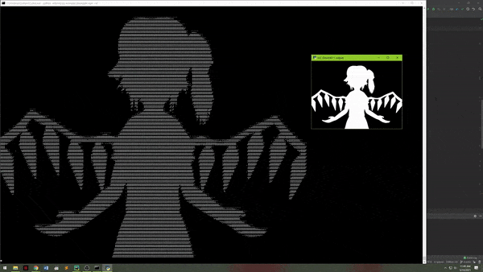
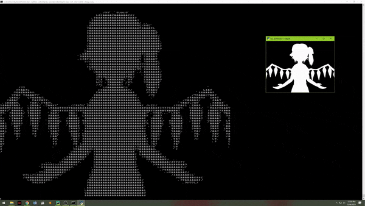
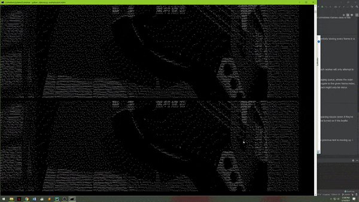
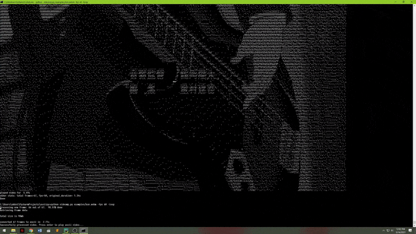

# asciipy

Python ASCII image and video converter to render images and videos in a console terminal


Renders given video file in the terminal using OpenCV and Pillow.

[video example](https://youtu.be/6DOj8AuO1G0)

# User Guide
Use `ascii.py` for single images or `videomp.py` to play videos in the console

## Setup
```
pip install -r requirements.txt
```
The following libraries are needed
* python_vlc: reference video and audio playback (not really synced with terminal playback)
* fpstimer: manage frame timings
* opencv_python: mainly used to grab frames from a video
* Pillow: image analysis

### Fonts
To render images and videos properly, a unicode monospace font must be used.
 
I've found that [Sarasa Mono CL](https://github.com/be5invis/Sarasa-Gothic) works the best for the braille and
Japanese characters. Install the font and set it as your terminal's font. This should work with different terminals
but I only tested Windows command prompt.

## Usage
```
videomp.py [input file] [optional parameters]`
```
The video will render to the size of the terminal window (might take a little bit a time). Clicking the terminal window will pause playback. Press any
key or right click to restart playback.
## Options
```
videomp.py -h

usage: videomp.py [-h] [-loop] [-ref] [-invert] [-char {braille,matrix,ascii}]
                  [-image {dither,halftone,gray,black_white,silhouette}] [-fps FPS]
                  file

Displays video in terminal

positional arguments:
  file                  input file

optional arguments:
  -h, --help            show this help message and exit
  -loop                 loop video
  -ref                  display reference video. need to add delay to sync properly with vlc player
  -invert               invert video colors. assuming the text is white
  -char {braille,matrix,ascii}
                        character conversion type
  -image {dither,halftone,gray,black_white,silhouette}
                        image conversion type
  -fps FPS              override display fps

```
ex. `videomp.py -ref -char martix -image halftone`


# Video Rendering
Videos are rendered into their ASCII (unicode) text equivalent via the following general process

1. Open video with OpenCV
2. Extract image data frame by frame
3. Convert each image to text
    1. Fit image to terminal screen size
    2. Invert image if needed
    3. Convert image based on given ImageType
    4. Convert pixels in image to their given CharType equivalent
    5. Join the 2d image array into a single string
4. Output text in console with the correct fps
    * Each text string is displayed one after the other with a delay to reach the given fps. just like a film projector

The `videomp.py` uses `multiprocessing` to get some performances improvements by splitting up the image processing work
between separate processes. Basically, each process is given a index range of frames to convert and output onto a shared
queue. A single listener then reads from that queue and orders the messages it gets. When that's done, it sends the
ordered list of converted frames back to the parent process to play the video. 

## Notes
All of the output is stored in memory so there's a limit to how large of a video can be played. Since we're essentially
storing every frame in a video as an uncompressed string.

If need be, we can remove this bottleneck in a couple of different ways
1. Store text output in external files. Load up files in a buffer to play the video
2. Encode strings for storage and decode when we need to play the video
3. Implement some form of [video compression](https://en.wikipedia.org/wiki/Video_compression_picture_types) 
so we only need to store key frames and their changes

Additionally, this is using a basic approach to divide work via multiprocessing. There's a minor issue where each worker
will only attempt to process their given range of frames, even if they finish early and there's still stuff left to
process.

Some colors can also be used if the terminal supports the respective ANSI escape codes.  

# Known Issues
### Fonts
Some fonts probably can't display braille unicode characters properly or if they can, have weird kerning and spacing
issues (even if they're monospace fonts). There's a `use_dot_spacing` flag in the `convert_to_braille` method in
`ascii.py` that can be turned on if the braille spacing doesn't seem right.
### Screen Flicker / Image Overlap
Since we're printing images one after the other, it's possible to notice some of the in between states when the previous
text is moving up. I don't know the exact cause, but it seems to happen for slower frame rates and larger terminal
screen sizes.



The main fix is either to make the screen smaller or increase/fiddle with the fps.


